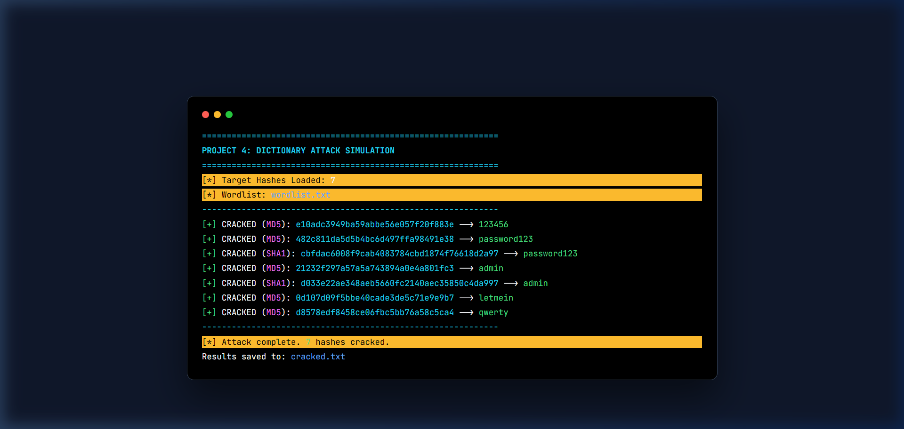

# 🛡️ Project 4 — Password & Hash Cracking (Native)

> **SkillInfyTech IT Solutions | Cybersecurity Internship**

## 📌 Overview

This project demonstrates how weak password hashes can be cracked using dictionary attacks. It covers the use of the `hashlib` library in Python to perform high-speed hashing of dictionary words to find a match for provided target hashes. 

Due to system-level WSL/Docker issues, this project is implemented as a native Windows Python application.

## 📸 Visual Documentation

### Password Cracking Simulation
Demonstrates a dictionary attack against MD5 and SHA1 hashes with real-time colored output.


## 🛠️ Tools Used

| Tool | Purpose |
|------|---------|
| **Python 3.14** | Core logic for hashing and comparison |
| **Hashlib** | Standard library for MD5 and SHA1 algorithms |

## 📁 Project Structure

```
project4-password-cracking/
├── README.md                  # This file
├── .gitignore
├── cracker.py                 # The hash cracking script
├── lab/
│   ├── hashes.txt             # Target MD5 and SHA1 hashes
│   ├── wordlist.txt           # Dictionary file for the attack
│   └── cracked.txt            # Captured results of the attack
└── reports/
    └── project4_password_cracking.md  # Final assessment report
```

## 🚀 How to Run

### Step 1: Prepare the Files
Ensure `lab/hashes.txt` contains the target hashes and `lab/wordlist.txt` contains your dictionary words.

### Step 2: Run the Cracker
```bash
python cracker.py
```
The results will be displayed on the console and saved to `lab/cracked.txt`.

## 📊 Key Concepts Covered
- **MD5 & SHA1**: Outdated and fast hashing algorithms that are highly susceptible to dictionary and brute-force attacks.
- **Dictionary Attack**: A technique for breaking into a system by entering every word in a dictionary as a password.
- **Salting & Pepper**: Adding random data to the input of a hash function to defend against precomputed attacks.
- **Key Stretching**: Using algorithms like BCrypt or Argon2 that are intentionally slow to prevent high-speed cracking.

## 📄 License
This project is part of the SkillInfyTech IT Solutions Cybersecurity Internship Program.
